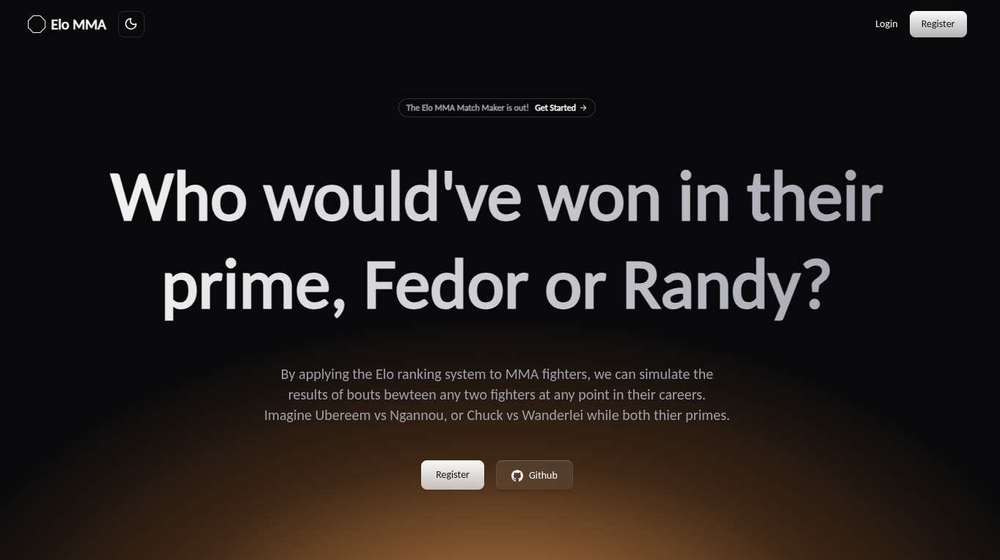

# ufc-elo
## TL;DR (What is this?)
### I wanted to apply Elo math to every MMA fighter in history, assign each fighter a rating, then rank them.

  

#### How'd I do this?
* I wrote python scripts to gather data on MMA fighters, bouts, and events:
    * [A crawler](https://github.com/CurtisWirtz/ufc-elo/tree/main/data_mining/crawler), which locates URLs containing the desired MMA data
    * [A scraper](https://github.com/CurtisWirtz/ufc-elo/tree/main/data_mining/scraper), which visits each URL discovered by the crawler, then copyies data from HTML elements containing specific CSS class names
* I built a full-stack system to store, organize and view a representation of the data:
    * Backend: Django with JWT auth, a Django REST Framework API, and PostgreSQL for the database
    * Frontend: Vite and Typescript/React ecosystem: 
        * Axios + React Query for data fetching
        * Tanstack Router (file-structure based)
        * Tailwind and ShadCN (+LaunchUI) for UI styling
        * react-hook-form + Zod for form validation and error messaging 
* I applied an Elo math algorithm to assign ratings to MMA fighters, similar to those given to chess players.

* I created a fantasy-matchup feature to compare how fighters would matchup at any time during their careers.

#### OK. So, it's far from perfect... but, it was pretty fun to build and I learned a ton.

## (Longer notes, taken during development):
### Collecting, aggregating, and displaying fight, bout, and event data from the Ultimate Fighting Championship (UFC).

This started with the goal of assigning Elo ratings to every UFC fighter on the roster throughout the history of the company, exclusively based on their performances in the UFC. Elo is the rating system that was devised for chess ranking and match making.

However, the scraped dataset grew to include all MMA promotions owned by Zuffa LLC (and now TKO Group Holdings), including the WEC, PRIDE FC, DWCS, KOTC, and a few other defunct fight promotions. 

In whetting my Python scripting, Django, PostgreSQL, and DRF skills, I went on to include a React ecosystem frontend interface to serve as a fight explorer. Mostly, I use it to aggregate data on fighters, bouts, or events for outcome prediction, avoiding sluggish MMA stats sites that are bogged down by the number of ads and popups that fill up my screen.

###### I began with data collection, then worked towards an interactive visual representation:

### 1. Crawler: 
###### (Python)
_**Locates web addresses where Fighter, Bout, and Event data exists on UFCStats.com.**_ 

I wrote a Python script that utilizes 8 threads/workers to automatically navigate thru and find the URL to every page on UFCStats.com. Built similarly to [Bucky Robert's open source web crawler](https://github.com/buckyroberts/Spider), but made specific to my needs. 

It generates a `.txt` file that contains every navigable hyperlink on that website.

### 2. Scraper: 
###### (Python, BeautifulSoup4)
_**A means to collect a full dataset about every Fighter, Bout, and Event in UFC history.**_ 

Using Python, I iterated thru the list of hyperlinks discovered by my the crawler in step 1. 

Every link is visited using the Python `requests` package, where `BeautifulSoup4` locates the desired data fields from HTML elements matching specific CSS selectors. The data collected from each page is compiled inside its own Python list, converted to a JSON object, then appended to its respective JSON file ( `fighters`, `events`, and `bouts` each generate their own file).

### 3. Backend + Data Ingestion: 
###### (Django, Python, PostgreSQL)
_**Taking the raw JSON data and migrating it into a PostgreSQL database that's attached to a Django backend.**_

I setup a Django backend and connected it to a PostgreSQL database. I prototyped and migrated the database models for `Fighter`, `Event`, and `Bout`, then wrote a loading script that runs a batch operation from the django CLI to create a table record for every object inside the JSON files created in step 2.

### 4. Frontend + REST API 
###### (API: Django REST Framework | Frontend: Vite, React, Typescript, Tanstack Router, React Query, Axios, `react-hook-form`, and Zod):
_**Making our data retrievable from a frontend / building a useful user interface.**_

In my django backend, I created REST API endpoints using the Django REST Framework to retrieve, serialize, order, paginate, and send data from the PostgreSQL database.

#### The Frontend

I started with a Vite/React install paired with Typescript.

Using `djangorestframework-simplejwt` and the file-based TanStack Router, I hid all paths that fetch data from our backend (`fighters`, `events`, and search) behind an authentication layer. Authorized (logged in) users are given a JWT access token, which is passed to the React components via context, allowing them to successfully send POST requests to the API.

Axios replaces using the `fetch()` API (nice error reporting!), and React Query handles memoized caching and preloading requests for frontend performance. I also built a basic 'Full-Text Search' style search function to find fighters and events based on keywords. Zod is useful for form validation on the Register, Login and Search inputs.

### 5. Style frontend UI
###### (ShadCN, Motion) 

Having spent years of my professional career building out custom UIs from scratch, I admire using UI component libraries immensely.

ShadCN was my choice because it's built on top of the work done by RadixUI, an open-source UI library that weighs accessibility concerns heavily. There are many competing UI frameworks that tout similar WCAG complaince claims, but fall short of this when I inspect their components with a screen reader. Plus it's built on Tailwind.

Note: [Mantine](https://ui.mantine.dev/) is another industry leader for **production-ready UI**. It also comes stock with great utility components like a calendar picker, but attempting a tailwind integration was PAINFUL, as Mantine is built with modular CSS... ShadCN it is!