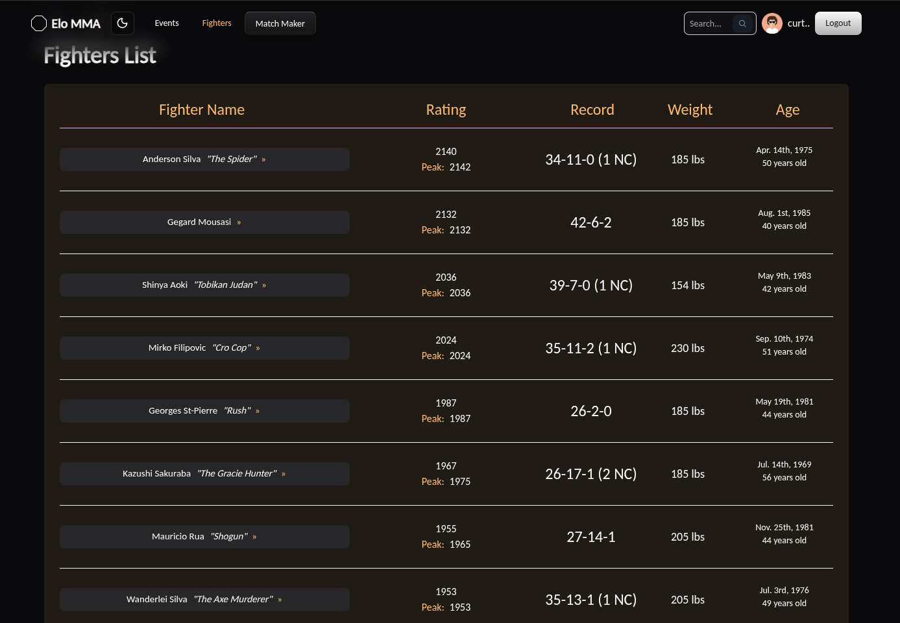
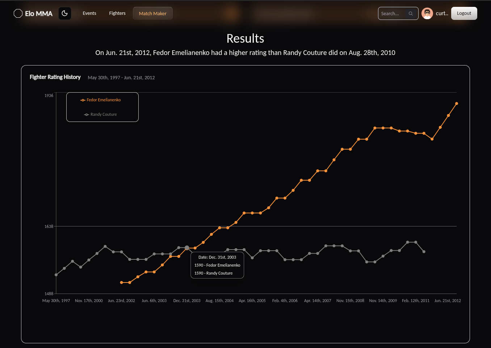
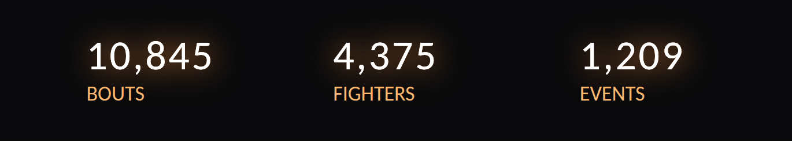
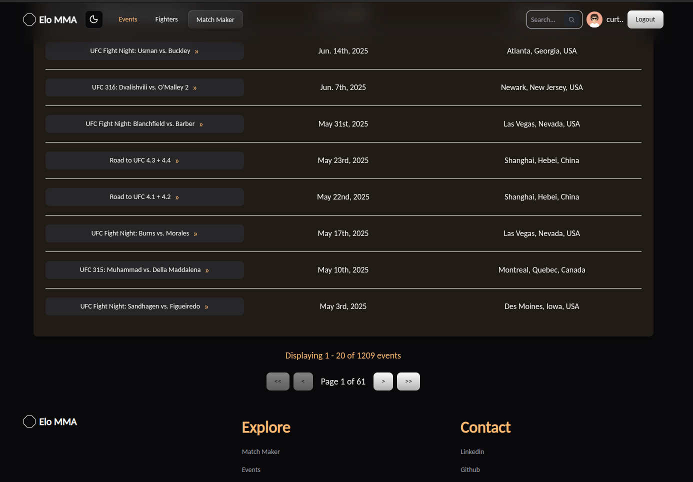

# What is this?

  

## I wanted to apply Elo math to every MMA fighter in history to assign each fighter a rating, then rank them.

The resulting top rated fighters of all-time:

  

The classic chess Elo math doesn't work so well for MMA, where results are far less predictable.
Others have explored [better suited Elo-based algorithms](https://medium.com/geekculture/ranking-mma-fighters-using-the-elo-rating-system-2704adbf0c94) to predict MMA outcomes.

## I later added a fantasy-matchup feature to compare fighters at any point in their careers.

  
  

I would have picked Fedor over Randy as well, but we'll never know!

## The dataset was quite large, but nothing compared the size of [Sherdog.com's](https://www.sherdog.com/)

  
  

### How'd I do this?
* I wrote python scripts to gather data on MMA fighters, bouts, and events:
    * [A crawler](https://github.com/CurtisWirtz/ufc-elo/tree/main/data_mining/crawler) with python `requests` and `BeautifulSoup4`, which locates URLs containing the desired MMA data
    * [A scraper](https://github.com/CurtisWirtz/ufc-elo/tree/main/data_mining/scraper) built similarly to [Bucky Robert's open source web crawler](https://github.com/buckyroberts/Spider), which visits each URL discovered by the crawler, then copies data from HTML elements containing specific CSS selectors
* I built an app to store, organize, aggregate, and view a representation of the data:
    * Backend: Django with JWT auth, a Django REST Framework API, and PostgreSQL for the database ingestion
    * Frontend: Vite and Typescript/React ecosystem: 
        * Axios + React Query for data fetching
        * Tanstack Router (file-structure based routing)
        * Tailwind CSS and ShadCN (+LaunchUI) for UI styling
        * react-hook-form + Zod for form validation and error messaging 
* I applied an [Elo math algorithm](https://github.com/CurtisWirtz/ufc-elo/blob/main/backend/api/management/commands/elo.py) to assign ratings to MMA fighters, similar to those given to chess players.
* I created a fantasy-matchup feature to compare how fighters would matchup at any time during their careers.
    * The React library [Recharts](https://recharts.github.io/) was very useful for representing the competing fighters' career trajectories.

#### OK. So, the Elo math may never be perfect... but, it was fun to build and see cursory results.

🔴 This project is no longer live on the web (I enjoyed the Reddit views, but not paying for VM hosting).